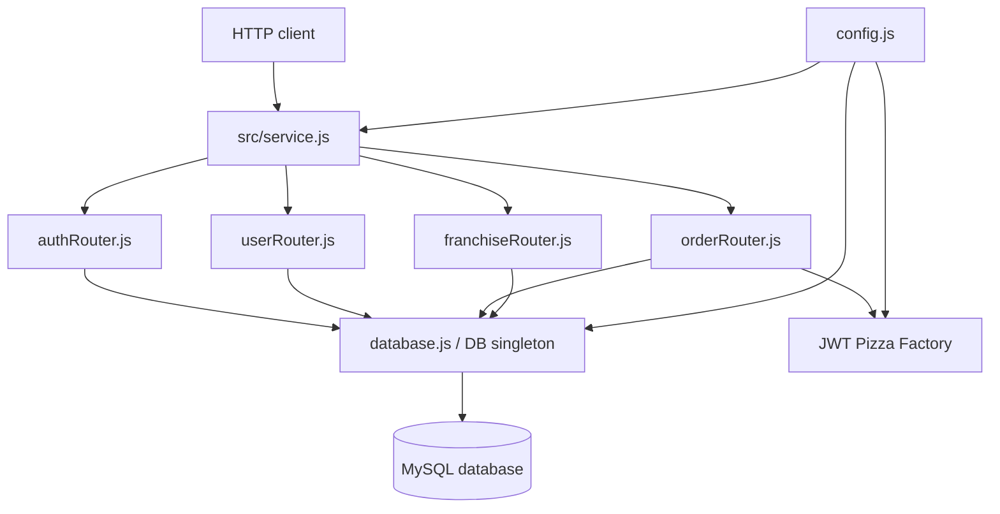
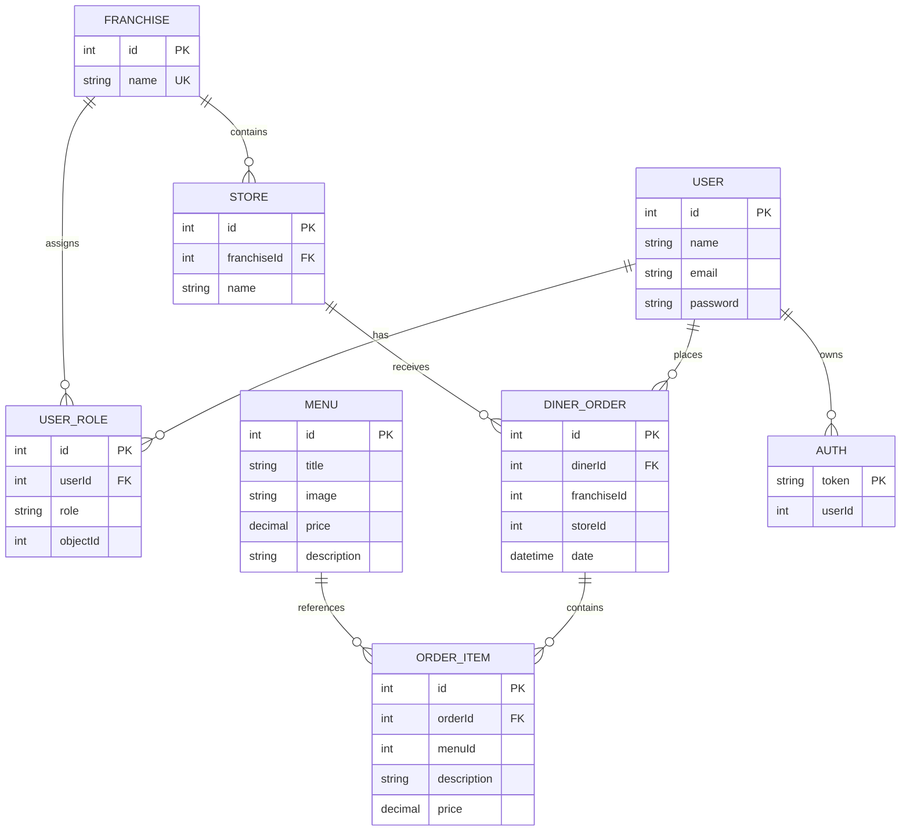
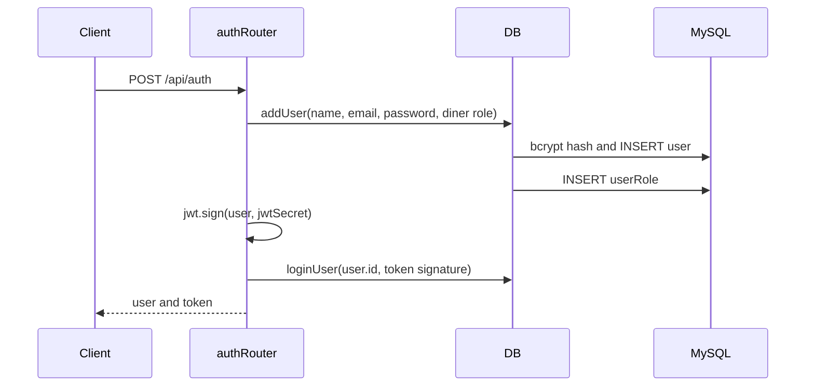
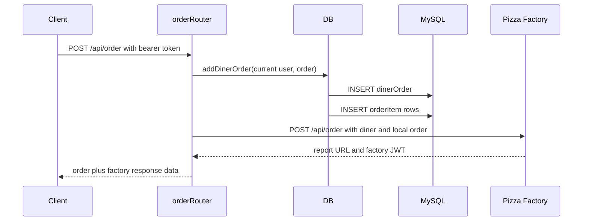

# JWT Pizza Service Architecture

## Purpose

`jwt-pizza-service` is an Express backend for a pizza ordering system. It provides:

- User registration, login, logout, and profile updates.
- JWT-based authentication backed by a database session record.
- A pizza menu that administrators can update.
- Franchise and store management.
- Diner order history and order creation.
- Forwarding newly created orders to the external JWT Pizza Factory.
- A generated endpoint description at `GET /api/docs`.

The service is intentionally compact. Most business behavior is implemented directly in the route modules and the `DB` class rather than in separate controllers, services, or repositories.

## High-level structure



### Source layout

| Path | Responsibility |
| --- | --- |
| `src/index.js` | Process entrypoint. Chooses the port and starts the Express app. |
| `src/service.js` | Creates the Express app, installs middleware, mounts routers, exposes docs, and handles 404/errors. |
| `src/config.js` | Local runtime configuration for JWT signing, MySQL, pagination, and the external factory. |
| `src/endpointHelper.js` | `asyncHandler` for forwarding rejected promises and `StatusCodeError` for HTTP-aware failures. |
| `src/routes/authRouter.js` | Registration, login, logout, token parsing, token validation, and JWT creation. |
| `src/routes/userRouter.js` | Authenticated user lookup and profile updates. |
| `src/routes/orderRouter.js` | Menu access, menu administration, order history, and factory order submission. |
| `src/routes/franchiseRouter.js` | Franchise/store listing and management with role checks. |
| `src/database/database.js` | The `DB` singleton. Opens MySQL connections, initializes the schema, hashes passwords, and runs application queries. |
| `src/database/dbModel.js` | SQL `CREATE TABLE IF NOT EXISTS` statements used during startup. |
| `src/model/model.js` | Shared role constants: `diner`, `franchisee`, and `admin`. |
| `src/init.js` | Command-line utility for creating an administrator user. |
| `src/version.json` | Service version returned by `/` and `/api/docs`. |
| `deployService.sh` | Builds a distribution directory, copies it to a server, installs dependencies, and restarts PM2. |

## Startup and initialization

The normal startup command is:

```sh
npm start
```

The `start` script changes into `src` and runs `node index.js`. `index.js` imports the already-configured Express app from `service.js`, then listens on the first command-line argument or port `3000`:

```sh
node src/index.js 3001
```

Loading `service.js` imports the routers. The routers import `database.js`, which constructs one `DB` instance immediately. The constructor starts `initializeDatabase()` and stores its promise in `this.initialized`.

Database initialization does the following:

1. Connects to MySQL without selecting the application database.
2. Checks whether the configured database exists.
3. Creates the database if needed and selects it.
4. Executes every statement in `dbModel.tableCreateStatements`.
5. On a newly created database, starts creation of the default admin account (`a@jwt.com` / `admin` in the current source).
6. Every later database operation waits for the initialization promise before opening its own connection.

Each operation creates a short-lived MySQL connection and closes it in a `finally` block. There is no connection pool. Database initialization errors are logged, but are not rethrown from startup; subsequent requests may therefore fail when they attempt to use the database.

## Request lifecycle

Every request passes through the middleware in `service.js` in this order:

1. `express.json()` parses JSON request bodies.
2. `setAuthUser` examines the `Authorization` header. If a bearer token is present, it verifies that the token signature exists in the `auth` table and then verifies the JWT signature.
3. CORS headers are added.
4. The `/api` router dispatches to one of the feature routers.
5. Protected endpoints use `authRouter.authenticateToken` to require `req.user`.
6. `asyncHandler` converts rejected promises into calls to Express's error handler.
7. Unknown paths return `{ "message": "unknown endpoint" }` with status `404`.
8. The final error handler uses `err.statusCode` when supplied, otherwise `500`, and returns the error message and stack.

The root endpoint, `GET /`, is outside `/api` and returns the service welcome message and version. The endpoint documentation endpoint is `GET /api/docs`; it combines the `docs` arrays exported by all four routers and includes the configured factory and database hosts.

## Authentication and authorization

### Login model

The service uses two checks for an authenticated request:

- The JWT must be cryptographically valid under `config.jwtSecret`.
- The token signature, which is the third dot-separated JWT segment, must still exist in the `auth` table.

On registration or login, `setAuth` signs the complete user object with `jsonwebtoken`, then stores the token signature and user ID in `auth`. On logout, the signature is deleted, which invalidates the token for future requests even if its JWT has not expired.

Passwords are hashed with bcrypt before insertion or update. `DB.getUser(email, password)` compares a supplied password with the stored hash and returns the user plus role records without the password field.

### Roles

Roles are stored in `userRole`:

- `diner`: assigned automatically on public registration.
- `franchisee`: associated with a particular franchise through `objectId`.
- `admin`: global role; its `objectId` is stored as `0`.

After a token is verified, `setAuthUser` attaches an `isRole(role)` helper to `req.user`. Route modules use that helper for authorization. Ownership checks are implemented in the route handlers, for example:

- A user can update their own profile; an admin can update any profile.
- A user can list their own franchises; an admin can list any user's franchises.
- An admin can create franchises and add menu items.
- An admin or a franchise administrator can create or delete stores.

## API responsibilities

All paths below are relative to `/api`.

### `/auth`

- `POST /auth`: validates `name`, `email`, and `password`, creates a diner, signs in the new user, and returns `{ user, token }`.
- `PUT /auth`: verifies credentials, signs in the user, and returns `{ user, token }`.
- `DELETE /auth`: requires authentication, deletes the current token record, and returns a logout message.

### `/user`

- `GET /user/me`: returns the authenticated user represented by the token.
- `PUT /user/:userId`: lets the user update their own name, email, or password, or lets an admin update another user. It returns a refreshed user and token.
- `DELETE /user/:userId`: currently returns `not implemented`.
- `GET /user`: currently returns an empty, `not implemented` response.

### `/order`

- `GET /order/menu`: public menu read.
- `PUT /order/menu`: admin-only menu insertion, followed by a fresh menu read.
- `GET /order`: authenticated order history for the current user. `page` is read from the query string and pagination uses `config.db.listPerPage`.
- `POST /order`: authenticated order creation. The order is first written to the local `dinerOrder` and `orderItem` tables, then sent to the external factory.

The outbound factory request is:

```http
POST {factory.url}/api/order
Content-Type: application/json
authorization: Bearer {factory.apiKey}
```

Its body contains a reduced diner object and the locally created order. A successful factory response is returned as `{ order, followLinkToEndChaos, jwt }`. A non-2xx factory response is converted to HTTP `500` while preserving the factory report URL when available.

### `/franchise`

- `GET /franchise`: public paginated franchise listing. Query parameters are `page`, `limit`, and `name`; `*` in the name filter is converted to SQL `%`.
- `GET /franchise/:userId`: authenticated users can retrieve their own franchises; admins can retrieve any user's franchises.
- `POST /franchise`: admin-only franchise creation. Each listed admin email must already belong to a user, and a franchisee role is added for the new franchise.
- `DELETE /franchise/:franchiseId`: deletes a franchise, its stores, and its franchise role rows in a transaction.
- `POST /franchise/:franchiseId/store`: admin or franchise administrator can create a store.
- `DELETE /franchise/:franchiseId/store/:storeId`: admin or franchise administrator can delete a store belonging to that franchise.

## Database model

The schema is created by `src/database/dbModel.js` and accessed by `src/database/database.js`.



Important data behavior:

- `userRole.objectId` is `0` for global roles and a franchise ID for `franchisee` roles.
- Order items copy `description` and `price` into `orderItem`; an order therefore preserves the submitted item details instead of deriving them later from the menu.
- `getOrders` loads order headers first and then loads items for each order.
- Franchise administrator views include administrator records and store revenue calculated from order-item prices.
- Franchise deletion explicitly removes stores, franchise role rows, and the franchise inside one transaction. Other multi-step writes, such as order creation and franchise creation, are not wrapped in a transaction.

## Representative request flows

### Registration



### Order creation



The local database write happens before the factory call. If the factory rejects the order or is unavailable, the local order remains stored and the client receives a `500` response. There is no retry or reconciliation worker in this repository.

## Configuration and secrets

`src/config.js` supplies three groups of settings:

- `jwtSecret`: signing key for JWTs.
- `db`: MySQL connection details and `listPerPage`.
- `factory`: factory URL and API key.

The configuration file is required at runtime and is copied by the deployment script. Keep real database passwords, JWT secrets, and factory API keys out of source control and replace the example/local values through the project's deployment process. The `/api/docs` response intentionally exposes only the configured factory and database hosts, not passwords or API keys.

## Deployment path

`deployService.sh` expects a private key and host:

```sh
bash deployService.sh -k path/to/key.pem -h server.example.com
```

It then:

1. Copies `src/*` and root JSON files into a temporary `dist` directory.
2. Removes and recreates `services/jwt-pizza-service` on the target host.
3. Copies the distribution to that directory over SCP.
4. Runs `npm install` remotely and restarts the PM2 process named `jwt-pizza-service`.
5. Removes the local `dist` directory.

The deployed application therefore runs from the copied `src` directory, with `src/index.js` as its process entrypoint. The deployment host must provide Node.js, npm, MySQL access, and a PM2 process configured with the expected name.

## Development workflow

1. Install dependencies with `npm install`.
2. Provide a working `src/config.js` with reachable MySQL and factory settings.
3. Start MySQL and run `npm start`.
4. Use `GET /api/docs` to inspect the endpoint catalog and examples.
5. Use `node src/init.js <name> <email> <password>` to create an additional admin account when needed.

There is no test suite or lint script declared in `package.json`. For changes, manually exercise the affected endpoint and verify both the HTTP response and relevant MySQL rows. When changing authentication or persistence, test the full flow because routers share the same `DB` singleton and authentication depends on both JWT verification and the `auth` table.

## Current implementation notes

These are important behaviors for a developer extending the service:

- Route modules are the authorization boundary. A database method generally assumes the route has already checked ownership or role permissions.
- `req.user` is only populated when both the database token lookup and JWT verification succeed.
- `asyncHandler` is required around asynchronous route handlers; otherwise rejected promises may bypass the intended error path in this Express 4 application.
- Database identifiers and some pagination values are interpolated into SQL strings. Validate numeric query and path values before adding new queries, and prefer parameterized SQL for values.
- The current `config.js` contains runtime credentials in the repository. Treat this as a deployment/security concern before sharing or deploying the code.
- `DELETE /api/franchise/:franchiseId` is currently not protected by `authenticateToken`, so its route behavior should be reviewed before relying on it in a production authorization model.
- User email uniqueness is not enforced by the schema, so registration does not prevent duplicate email addresses at the database level.
- The factory call uses the global `fetch` API, so the runtime must provide a Node version with built-in `fetch` support.
- Some requested operations are intentionally placeholders: user deletion and user listing.

## Where to make common changes

- Add or change an endpoint: edit the relevant file under `src/routes/`, add or update its `docs` entry, and use `asyncHandler` for asynchronous work.
- Add a database operation: add a method to `DB` in `src/database/database.js`; use parameterized queries and close connections in `finally`.
- Change the schema: update `src/database/dbModel.js`, then consider migration behavior for databases that already exist because the startup statements only create missing tables.
- Change authentication: inspect `setAuthUser`, `authenticateToken`, `setAuth`, `loginUser`, and `logoutUser` together; token validation is intentionally split between JWT and MySQL.
- Add a role: update `src/model/model.js`, decide whether it is global or resource-scoped, and update the role insertion and route authorization logic.
- Change the external factory integration: update the order creation path in `src/routes/orderRouter.js` and keep the local persistence and remote failure behavior explicit.
- Change deployment: update `deployService.sh` and confirm that the target PM2 process and runtime satisfy the assumptions above.
